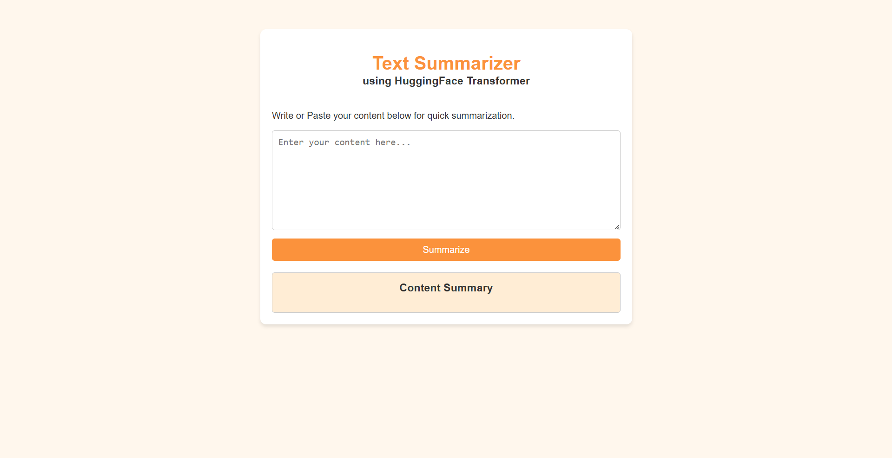

# 📝 Text Summarizer App (FastAPI + T5 Transformer)

## 🚀 Overview

This project is a **Text Summarization Web Application** built using **FastAPI** and the **T5 Transformer model** from HuggingFace.
It generates concise summaries from long text input.

---

## 🎯 Features

* 🔹 Summarizes long text into short, meaningful content
* 🔹 Built with FastAPI
* 🔹 Uses pre-trained T5 Transformer model
* 🔹 Simple UI using Jinja2 templates

---

## 🛠️ Tech Stack

* **Backend:** FastAPI
* **Model:** HuggingFace Transformers (T5)
* **Frontend:** HTML (Jinja2 Templates)
* **Libraries:** PyTorch, Pandas

---

## 📁 Project Structure

```id="8z0c3k"
TextSummarizerApp/
│── app.py
│── templates/
│── saved_summary_model/
│── requirements.txt
│── README.md
```

---

## ⚙️ How to Run

### 1️⃣ Install dependencies

```id="v45y2j"
pip install -r requirements.txt
```

### 2️⃣ Run the server

```id="9exvdj"
python -m uvicorn app:app --reload
```

### 3️⃣ Open in browser

```id="hyt4az"
http://127.0.0.1:8000
```

---

## 📌 How It Works

1. User enters long text
2. FastAPI processes the request
3. T5 model generates summary
4. Result is displayed

---

## 📦 Requirements

* fastapi
* uvicorn
* transformers
* torch
* sentencepiece
* pandas
* jinja2

---

## 🎥 Demo Video

[](Working%20video.mp4)

---

## 👨‍💻 Author

Durgesh Nandan

---

⭐ Star this repo if you found it useful!
